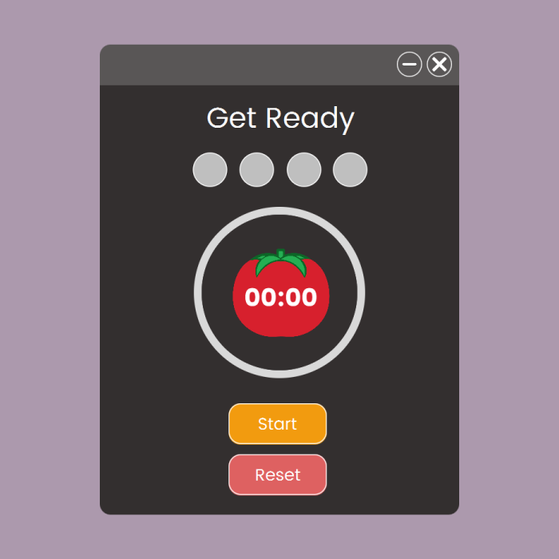
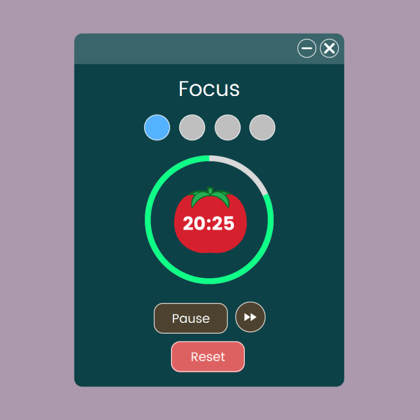
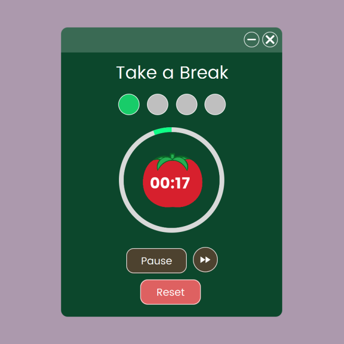
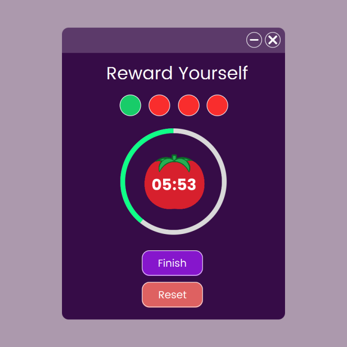

# Pomodoro Timer App

## Project Overview
The Pomodoro Timer App is a simple productivity tool that implements the Pomodoro Technique, allowing users to alternate between focus sessions and breaks. The app provides fixed time intervals for [Focus - 25 minutes, Short Break - 5 minutes, Long Break - 15 minutes], which are hard-coded for now.

This app was built using **JavaFX** to implement the UI, the **Timer** class for time tracking, and **org.controlsfx.control.Notifications** to display notifications when a session ends. It is designed with simplicity in mind, featuring four visually distinct screens: Initial, Focus, Short Break, and Long Break.

---

## Features
- **Pomodoro Time Intervals**
    - Focus (25 minutes)
    - Short Break (5 minutes)
    - Long Break (15 minutes)

- **Core Functionality**
    - Start, Stop, Resume, and Reset timers.
    - Notifications when the session ends.

- **Simple Design**
    - Four screens visually representing different Pomodoro states.
    - Circles indicate completed Pomodoro cycles.
    - A **Circular Progress Indicator** to track session progress in real time.

---

## Future Enhancements
- **Near Future**: Allow users to edit time intervals dynamically.
- **Far Future**: Add tasks or to-do functionality for better productivity tracking.

---

## Technologies Used
- **JavaFX** for UI components and screen design.
- **Timer Class** for time management.
- **org.controlsfx.control.Notifications** for session alerts.

---

## How to Run the Project
1. Clone this repository.
2. Ensure you have JavaFX and ControlsFX dependencies installed.
3. Run the `Main.java` file to launch the app.

---

## Screenshots
- **Initial Screen**  
  

- **Focus Screen**  
  

- **Short Break Screen**  
  

- **Long Break Screen**  
  

---

## Purpose
This app was built as part of a Java basics course to demonstrate proficiency with Java, JavaFX, and Timer functionalities while following a structured development approach.  